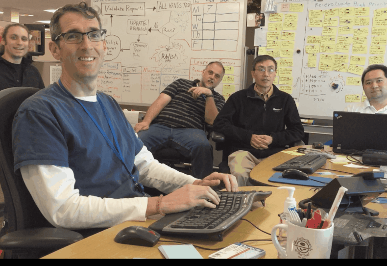

<!-- GENERATED DOCUMENT! DO NOT EDIT! -->
# Ensemble or Mob Development #

## Table Of Contents ##

- [Section 1: Summary](#user-content-summary)
- [Section 2: Goal](#user-content-goal)
- [Section 3: Benefits](#user-content-benefits)
- [Section 4: What are my responsibilities](#user-content-what-are-my-responsibilities)
- [Section 5: How do I go about it](#user-content-how-do-i-go-about-it)
- [Section 6: Hot Tips and Tricks](#user-content-hot-tips-and-tricks)
- [Section 7: FAQ](#user-content-faq)
- [Section 8: Other Resources](#user-content-other-resources)
- [Section 9: Back To Other Documents](#user-content-back-to-other-documents)

## Summary ##

Ensemble Development is a practice that brings the whole team together to work in a highly collaborative way. Everybody works on the same thing at the same time, on the same computer. The focus here is active, vibrant communication. The practice does not generate all or any benefits if the communication is stifled, rigid, or non-existent.
    

## Goal ##

Ensemble Development aims to amplify collaboration. It is worth noting that sometimes, to amplify collaboration, you will need to focus on teaching and learning. However, it is important not to let the teaching override the collaboration.
    

## Benefits ##

* Shared understanding of the work being done.
* High bandwidth education of people less experienced with the work being done.
* High quality of work.
* More points of view being incorporated into the work.
* Faster than solo development.
    

## What are my responsibilities ##

### Customer/Product Owner ###

The customer/product owner is encouraged to be part of the Ensemble/Mob as they work. This ensures that what is being developed matches expectations directly.

### Coach ###

Build an environment where Ensemble work is accepted and encouraged. Help the team see disruptions to collaboration.

### Development Team ###

The development team’s responsibility is to ensure that Ensemble Development is achieving the goal of facilitating hyper collaboration.
    

## How do I go about it ##

<table style="border=none!important">
<tr><td width=30%></td><td width=40%></td><td width=30%></td></tr>
<tr>

<!-- 1st Item -->
<td>
    
</td>
<td colspan=2>

### 1.	Decide on the work to be done. ###

This works well when the work to be done has any of the following attributes:

* The understanding is unevenly distributed.
* The work is complicated, making it easy to make a mistake.
* The work is complex, and all the requirements of the work being done cannot be known upfront.

</td>
</tr>
<tr>
<td colspan=2>

### 2.	Decide how and where you are going to work. ###

There are many roles and two positions when doing this type of work. The two positions are Driver and Navigator. The person who has control of the keyboard is the driver. Everyone else is the navigator. The driver's job is to listen to all the navigators and distill that into a coherent change. The navigator's job is to guide at the highest possible level where the changes are going.

The role a person takes on depends on what is needed. It could be someone paying attention to security requirements, coding standards, spelling errors, or whatever seems necessary at the time. You can examine the roles presented in the [Mob Programming Role Playing Game](https://github.com/willemlarsen/mobprogrammingrpg) for ideas of where to start.

It is recommended that you use a practice called Strong Navigation. This means that the person with the idea cannot touch the keyboard. This forces an idea to go through at least one other individual before entering a computer.

It is also recommended that you rotate who is in the Driver position to prevent one person from not having their ideas heard and keep one from feeling stuck. This can be done on a timer, at a logical stopping point, or any other method.

You will need to decide if you are doing Strong Navigation or not and how to rotate the driver position. You will also need to determine where the work will be done. The notion of the same computer is squishy as the intent is that everyone can see the changes done in real time and have access to those changes should they take over.

</td>
<td width=30%>

</td>
</tr>
<tr height=100%>
<td width=30%>

</td>
<td colspan=2>

### 3.	Collaborate ###

This sounds much easier than it is. When collaborating, you must be aware of people not speaking or voices being ignored. Take time to ensure everyone can navigate. If someone is not navigating, ensure it is not because they don’t know what to do. If at any point someone feels lost or out of touch with what is happening, stop and address that. This practice works best when the focus is on ensuring everyone knows how to do things rather than getting things done. Paradoxically, by not focusing on speed, you acquire more speed.

</td>
</tr>
</table>
    

## Hot Tips and Tricks ##

* Optimize for learning.
  * Go at the speed of the slowest member.
  * Ensure everyone can explain the solution and why we will use it.
  * Take the opinion of the least qualified member when there is more than one opinion.
* Take frequent breaks; this high-bandwidth collaboration is tiring.
* Respect everyone’s voice/opinion.
* Look for when someone is not speaking.
* Start by rotating the driver on a time limit.
  * Go smaller than you think is reasonable and grow from there.
* Do not accept low amounts of collaboration. If collaboration is down, dig into why.
* Start with micro retros approximately every 20 minutes to tune the group communications.
    

## FAQ ##

### Isn’t it more expensive to have everyone working on the same thing rather than individual things? ###

That depends. When collaboration is low, you only get a few benefits listed above. When collaboration is high, you gain all the benefits listed above. The question is, really, do the benefits outpace the cost? In my experience, if the collaboration is high, the answer has always been yes.

### Doesn’t this form of work deteriorate into groupthink? ###

Again, that depends. If the group does not focus on learning or the collaboration deteriorates, then it can. Most often, when I see it deteriorating, it isn’t into groupthink so much as following the leader, where one voice drowns out the others.

### How do I prevent lazy people from hiding within the work of a group? ###

This is a difficult question because there are a lot of things tied into this question. Let’s start by defining everyone’s responsibility in the group so we can then explain what it means to be a slacker within the group. Everyone within the mob should always be doing the following things in equal measure:

* Actively Collaborating.
* Explaining an idea.
* Taking a short mental break.
* Digesting information.
* Seeking understanding.
* Drawing attention to things within the group dynamics that need to be refined.

If anyone spends too much time in any of these modes, there is a problem with how the team functions. This behavior needs to be examined, and the team needs to determine what will change it. As for active bad actors, if everyone else tries to rotate through these modes, they will detect people who genuinely have no interest in contributing meaningfully. So, first, determine if the team is functioning optimally. Then, if they are, listen to the team. Otherwise, focus on getting the team members to cycle through these behaviors.
    

## Other Resources ##

[LinkedIn Learning](https://www.linkedin.com/learning/agile-software-development-pair-and-mob-programming/tools-for-mob-programming?u=70938826)

[Mob Programming Surprised Me (YouTube)](https://www.youtube.com/watch?v=ikilHGYk5Fs)

[HBR Article on Sustained Collaboration](https://hbr.org/2019/11/cracking-the-code-of-sustained-collaboration)
    

## Back To Other Documents ##

[Documents about XP Practices](README.md)
    

<!-- GENERATED DOCUMENT! DO NOT EDIT! -->
    